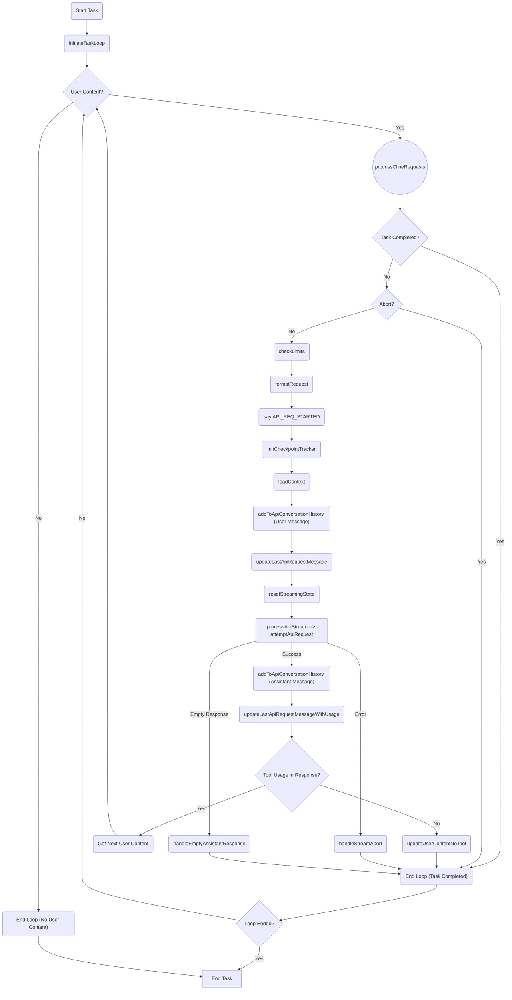

## Workflow Diagram

## アプリケーションの目的

このアプリケーション (cline-cli) は、AIモデルを活用して様々なタスクを自動化するためのCLIツールです。ユーザーはコマンドラインから指示を与えることで、ファイルの編集、コード生成、システム操作など、多岐にわたる作業をAIに実行させることができます。

このツールの主な目的は、AIの能力を最大限に引き出し、ユーザーの作業効率を飛躍的に向上させることです。複雑なタスクを自動化し、反復作業から解放することで、ユーザーはより創造的で重要な業務に集中できるようになります。

## ワークフローの説明

ワークフローは \`startTask\` 関数から始まり、タスクを初期化し、\`initiateTaskLoop\` 内のメインループを開始します。

\`initiateTaskLoop\` 関数は、アプリケーションのワークフローの中核です。タスクが完了または中断されるまで、ユーザーコンテンツを継続的に処理します。

**メインループのステップ:**

1. **ユーザーコンテンツの確認**: ループは、処理するユーザーコンテンツがあるかどうかを確認することから始まります。ない場合、ループは終了します。
2. **Clineリクエストの処理**: ユーザーコンテンツが存在する場合、\`processClineRequests\` 関数が呼び出され、APIリクエストとレスポンスのサイクルを処理します。
3. **タスク完了の確認**: \`processClineRequests\` 内で、システムはタスクが完了としてマークされているかどうかを確認します。マークされている場合、ループは終了します。
4. **中断信号の確認**: 次に、中断信号があるかどうかを確認します。中断信号がある場合、ループは終了します。
5. **制限の確認**: \`checkLimits\` 関数は、制限（例：連続ミス）に達していないか検証します。達している場合、ユーザーにガイダンスを求めることがあります。
6. **リクエストのフォーマット**: \`formatRequest\` 関数は、APIリクエストのためにユーザーコンテンツを準備します。
7. **APIリクエスト開始の通知**: APIリクエストの開始を示すメッセージが \`say\` 関数を使用して表示されます。
8. **チェックポイントトラッカーの初期化**: \`initCheckpointTracker\` は、チェックポイント追跡システムを設定します。
9. **コンテキストのロード**: \`loadContext\` は、APIリクエストに含める関連コンテキスト情報（例：ファイルの詳細、環境の詳細）を収集します。
10. **ユーザーメッセージを履歴に追加**: ユーザーメッセージは、ロードされたコンテキストとともに、API会話履歴に追加されます。
11. **最後のAPIリクエストメッセージの更新**: 最後のAPIリクエストメッセージが、現在のリクエストの詳細で更新されます。
12. **ストリーミング状態のリセット**: \`resetStreamingState\` は、APIストリーミングに関連する状態変数をリセットします。
13. **APIストリームの処理**: \`processApiStream\` は、\`attemptApiRequest\` を使用してAPIリクエストを開始し、レスポンスストリームを処理します。
14. **APIレスポンスの処理**:
    - **成功**: APIリクエストが成功した場合、アシスタントのメッセージが抽出され、API会話履歴に追加されます。
    - **エラー**: APIリクエスト中にエラーが発生した場合、\`handleStreamAbort\` が呼び出されてエラーを処理します。
    - **空のレスポンス**: APIが空のレスポンスを返した場合、\`handleEmptyAssistantResponse\` が呼び出されます。
15. **トークン使用量で最後のAPIリクエストメッセージを更新**: APIレスポンスからのトークン使用量情報を使用して、最後のAPIリクエストメッセージを更新します。
16. **ツール使用状況の確認**: システムは、アシスタントのレスポンスにツール使用リクエストが含まれているかどうかを確認します。
17. **次のユーザーコンテンツを取得またはツール未使用を更新**:
    - **ツール使用**: ツール使用が検出された場合、システムは、ツール実行に基づいて、次のユーザーコンテンツを処理する準備をします。
    - **ツール未使用**: ツール使用が検出されなかった場合、\`updateUserContentNoTool\` は、ツールが使用されなかったことをユーザーに通知し、ミスカウンターをインクリメントします。その後、ループは終了します。
18. **ループの終了**: ループは、ユーザーコンテンツがない、タスク完了、中断信号、またはアシスタントのレスポンスにツール使用がないなど、いくつかの条件で終了する可能性があります。
19. **タスクの終了**: ループが終了すると、\`タスクの終了\` 状態に到達し、タスクは完了または終了と見なされます。

この詳細なワークフロー図と説明は、アプリケーションのコアロジックの良い概要を提供するはずです。

## アプリケーション改善のアイデア

このアプリケーション (cline-cli) をさらに改善するためのアイデアを以下にまとめます。

1. **コンテキスト情報の拡充**:
   - `loadContext` で収集するコンテキスト情報を拡充し、AIに提供する情報量を増やすことで、より適切な意思決定を支援します。
   - 例: 最近編集したファイル、Gitの差分、実行環境の詳細 (OS, Node.jsバージョンなど)、プロジェクトの依存関係リスト (package.json, requirements.txt など) をコンテキストに含める。
   - これにより、AIはよりプロジェクトの状況を深く理解し、より適切な提案やコード生成が可能になるでしょう。

2. **ツール実行結果のフィードバック強化**:
   - ツール実行後、その結果をユーザーに詳細にフィードバックする仕組みを導入します。
   - 例: 実行されたコマンド、変更されたファイルのdiff、エラーメッセージ、実行時間などを表示する専用のUIを設ける。
   - ツールがどのように動作したかをユーザーが把握しやすくなり、信頼性向上やデバッグに役立ちます。

3. **対話的なタスク実行の導入**:
   - 現在のワークフローはAPIリクエストのループ処理が中心ですが、ユーザーがより柔軟にタスク実行をコントロールできるように、対話的な要素を取り入れます。
   - 例:
     - タスク実行中にユーザーがAIの思考プロセスに介入し、指示を修正したり、追加の指示を与えられるようにする。
     - AIがタスク実行中に不明な点や判断が必要な場合に、ユーザーに質問を投げかけ、回答を得てから処理を続行する。
     - これにより、より複雑なタスクや、ユーザーの意図を細かく反映させたいタスクへの対応力が向上します。

4. **チェックポイント機能の強化**:
   - 現在のチェックポイント機能 (`CheckpointTracker`) を拡張し、タスクの中断・再開機能や、エラー発生時のロールバック機能を強化します。
   - 例:
     - タスクを特定の状態に戻して再開する機能 (ロールバック)。
     - ユーザーが意図的にタスクを分岐させ、異なるアプローチを試せるようにする機能。
     - 複数のタスクを並列に実行し、進捗状況を管理する機能。
   - これにより、タスク実行の柔軟性と安定性が向上し、より安心してツールを利用できるようになります。

5. **エラーハンドリングとユーザーサポートの改善**:
   - エラー発生時のエラーメッセージをより分かりやすく、具体的な解決策を提示するように改善します。
   - 例:
     - エラーコード、エラーが発生した場所、エラーの原因と考えられる状況、解決策の候補などを提示する。
     - よくあるエラーとその解決策をまとめたFAQドキュメントや、ユーザーサポート窓口へのリンクをエラーメッセージに含める。
   - エラー発生時のユーザーのストレスを軽減し、迅速な問題解決を支援します。

これらの改善アイデアは、cline-cliをより強力で使いやすいツールにするための方向性を示唆しています。今後の開発において、これらのアイデアを参考に機能拡張やUI/UXの改善を進めていくことで、ユーザーにとってより価値の高いツールへと進化していくことが期待されます。
## Workflow Diagram

## アプリケーションの目的

このアプリケーション (cline-cli) は、AIモデルを活用して様々なタスクを自動化するためのCLIツールです。ユーザーはコマンドラインから指示を与えることで、ファイルの編集、コード生成、システム操作など、多岐にわたる作業をAIに実行させることができます。

このツールの主な目的は、AIの能力を最大限に引き出し、ユーザーの作業効率を飛躍的に向上させることです。複雑なタスクを自動化し、反復作業から解放することで、ユーザーはより創造的で重要な業務に集中できるようになります。

## ワークフローの説明

ワークフローは \`startTask\` 関数から始まり、タスクを初期化し、\`initiateTaskLoop\` 内のメインループを開始します。

\`initiateTaskLoop\` 関数は、アプリケーションのワークフローの中核です。タスクが完了または中断されるまで、ユーザーコンテンツを継続的に処理します。

**メインループのステップ:**

1. **ユーザーコンテンツの確認**: ループは、処理するユーザーコンテンツがあるかどうかを確認することから始まります。ない場合、ループは終了します。
2. **Clineリクエストの処理**: ユーザーコンテンツが存在する場合、\`processClineRequests\` 関数が呼び出され、APIリクエストとレスポンスのサイクルを処理します。
3. **タスク完了の確認**: \`processClineRequests\` 内で、システムはタスクが完了としてマークされているかどうかを確認します。マークされている場合、ループは終了します。
4. **中断信号の確認**: 次に、中断信号があるかどうかを確認します。中断信号がある場合、ループは終了します。
5. **制限の確認**: \`checkLimits\` 関数は、制限（例：連続ミス）に達していないか検証します。達している場合、ユーザーにガイダンスを求めることがあります。
6. **リクエストのフォーマット**: \`formatRequest\` 関数は、APIリクエストのためにユーザーコンテンツを準備します。
7. **APIリクエスト開始の通知**: APIリクエストの開始を示すメッセージが \`say\` 関数を使用して表示されます。
8. **チェックポイントトラッカーの初期化**: \`initCheckpointTracker\` は、チェックポイント追跡システムを設定します。
9. **コンテキストのロード**: \`loadContext\` は、APIリクエストに含める関連コンテキスト情報（例：ファイルの詳細、環境の詳細）を収集します。
10. **ユーザーメッセージを履歴に追加**: ユーザーメッセージは、ロードされたコンテキストとともに、API会話履歴に追加されます。
11. **最後のAPIリクエストメッセージの更新**: 最後のAPIリクエストメッセージが、現在のリクエストの詳細で更新されます。
12. **ストリーミング状態のリセット**: \`resetStreamingState\` は、APIストリーミングに関連する状態変数をリセットします。
13. **APIストリームの処理**: \`processApiStream\` は、\`attemptApiRequest\` を使用してAPIリクエストを開始し、レスポンスストリームを処理します。
14. **APIレスポンスの処理**:
    - **成功**: APIリクエストが成功した場合、アシスタントのメッセージが抽出され、API会話履歴に追加されます。
    - **エラー**: APIリクエスト中にエラーが発生した場合、\`handleStreamAbort\` が呼び出されてエラーを処理します。
    - **空のレスポンス**: APIが空のレスポンスを返した場合、\`handleEmptyAssistantResponse\` が呼び出されます。
15. **トークン使用量で最後のAPIリクエストメッセージを更新**: APIレスポンスからのトークン使用量情報を使用して、最後のAPIリクエストメッセージを更新します。
16. **ツール使用状況の確認**: システムは、アシスタントのレスポンスにツール使用リクエストが含まれているかどうかを確認します。
17. **次のユーザーコンテンツを取得またはツール未使用を更新**:
    - **ツール使用**: ツール使用が検出された場合、システムは、ツール実行に基づいて、次のユーザーコンテンツを処理する準備をします。
    - **ツール未使用**: ツール使用が検出されなかった場合、\`updateUserContentNoTool\` は、ツールが使用されなかったことをユーザーに通知し、ミスカウンターをインクリメントします。その後、ループは終了します。
18. **ループの終了**: ループは、ユーザーコンテンツがない、タスク完了、中断信号、またはアシスタントのレスポンスにツール使用がないなど、いくつかの条件で終了する可能性があります。
19. **タスクの終了**: ループが終了すると、\`タスクの終了\` 状態に到達し、タスクは完了または終了と見なされます。

この詳細なワークフロー図と説明は、アプリケーションのコアロジックの良い概要を提供するはずです。
